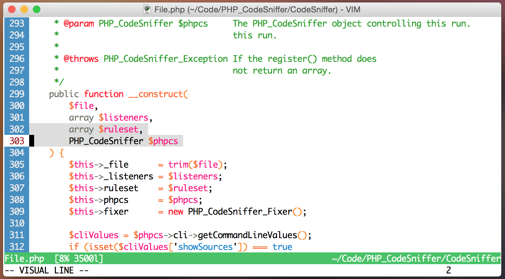

summerfruit256
==============
A fruity 256-colour colourscheme for vim, macvim and gvim.

### Improvements over [vimscript #2577](http://www.vim.org/scripts/script.php?script_id=2577)

* Removed some unnecessary lines.
* Improved vimdiff settings.
* Improved visibility of visual selections for terminals.

### Screenshot

History
-------
This is based on
[vimscript #2577](http://www.vim.org/scripts/script.php?script_id=2577),
which is a 88/256 color version of Armin Ronacher's summerfruit color scheme
[vimscript #1872](http://www.vim.org/scripts/script.php?script_id=1872).
These scripts use Henry So Jr.'s color approximation (vimscript #1243) for the
color conversion.
